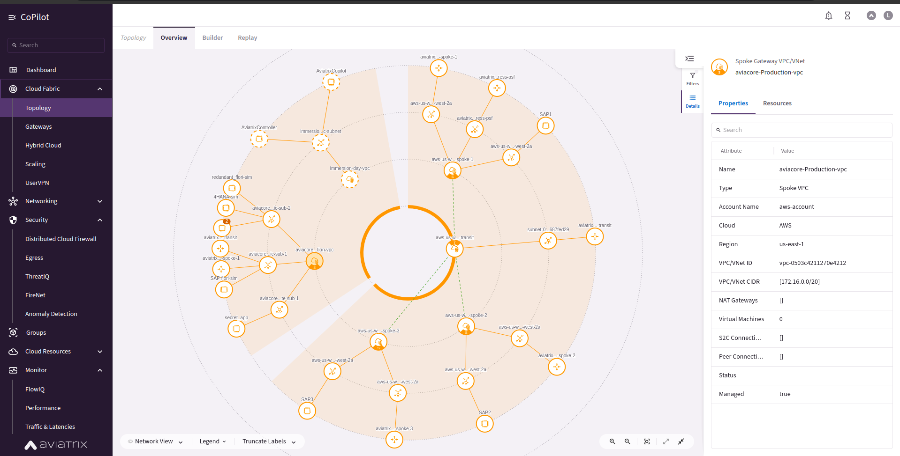

# aviacore
To be used with aviatrix immersion days

![]


# Aviacore Terraform Configuration Project

Welcome to the Aviacore Terraform Configuration project! This guide will help you set up and manage a robust cloud infrastructure using Terraform and Aviatrix on AWS.

## What Does This Project Do?

This project uses Terraform to configure and deploy:

1. A virtual private cloud (VPC) with subnets.
2. Security groups to manage access.
3. Private EC2 instances accessible via AWS SSM.
4. Aviatrix-based advanced networking configurations:
    - Spoke gateways.
    - Distributed firewall groups.
    - Smart and web groups.

## Repository Structure

```
.
├── Docs/                      # Documentation folder
│   └── docs.md                # Detailed documentation for the project
├── main.tf                    # Main Terraform configuration
├── modules/                   # Modules for reusable Terraform components
│   ├── aviatrix-dist-fw/      # Aviatrix distributed firewall configuration
│   ├── aviatrix-smart-grp/    # Aviatrix smart group configuration
│   ├── aviatrix-spoke-gw/     # Aviatrix spoke gateway configuration
│   ├── aviatrix-web-grp/      # Aviatrix web group configuration
│   ├── ec2/                   # EC2 instance configuration
│   ├── sg/                    # Security group configuration
│   └── vpc/                   # VPC and subnet configuration
├── providers.tf               # Terraform provider configurations
├── variables.tf               # Variables and default values (hidden)
└── README.md                  # This file

```
## Before You Start

### Prerequisites

1. **Terraform:** Install Terraform.
2. **AWS Account:** Ensure you have an AWS account and an IAM user with permissions for VPC, EC2, and Aviatrix resources.
3. **Installed aviatrix controller:** I will not be showing this as the controller is already installed but refer to [https://docs.aviatrix.com/documentation/v7.1/getting-started/getting-started-guide-aws.html?expand=true#:~:text=Deploy%20with%20Terraform,available%2C%20the%20deployment%20will%20fail.].


---

## Step-by-Step Guide

### 1. Clone the Repository

`git clone https://github.com/alvo254/aviacore.git cd aviacore`

### 2. Initialize Terraform

Run the following command to initialize the Terraform environment:

`terraform init`

### 3. Review the Configuration

Preview the changes Terraform will make by running: (optional)

`terraform plan`

### 4. Apply the Configuration

Deploy the resources using:

`terraform apply --auto-approve`

### 5. Access Your Resources

After the deployment, the public IP addresses of your EC2 instances and Aviatrix gateways will be displayed. Use the SSH key to connect to the EC2 instance:


---

## Customizing Your Setup

### Key Configuration Files:

- **`main.tf`:** The main configuration file for the project.
- **`variables.tf`:** Customize variables such as region, instance size, or VPC CIDR blocks.
- **Module Subdirectories:** Each module (e.g., `modules/sg`, `modules/vpc`) contains `main.tf`, `variables.tf`, and `outputs.tf` for resource-specific configurations.

For example, to modify the VPC CIDR block:

1. Open `modules/vpc/variables.tf`.
2. Update the `cidr_block` variable.

### Adding New Modules

To extend the functionality, create a new module under `modules/`, and define the necessary Terraform configurations.

---

## Contributing

We welcome contributions to improve the configuration or documentation. Follow these steps:

1. Fork the repository
2. Create a new branch (`git checkout -b feature/AmazingFeature`)
3. Commit your changes (`git commit -m 'Add some AmazingFeature'`)
4. Push to the branch (`git push origin feature/AmazingFeature`)
5. Open a Pull Request